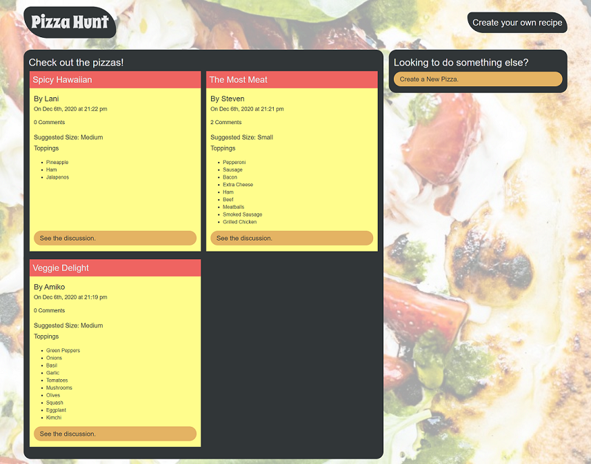

# Pizza Hunt
  
  
  
  

## Project Description
This project creates a back-end for a pizza creation and discussion application for a fictional company called Pizza Hunt.  MongoDB, Mongoose, Express.js, and Node are used. The front end code was provided mostly complete and modified as needed to connect with the database. People can create pizza recipes and share them, comment on existing recipes, and reply to comments. Routes are in place for future deployment of capability to edit and to delete pizzas, comments, and replies.

## Tools Used to Create This Project
* Javascript ES6
* Node.js
* Express.js
* MongoDB
* Mongoose
* Mongo Atlas
* Heroku

## Deployed Application
This application can be found at: https://mysterious-eyrie-27576.herokuapp.com/ 

## Screenshot

## License
  **Licensed under the MIT License.**

 MIT License

Copyright (c) 2020 Week In View

Permission is hereby granted, free of charge, to any person obtaining a copy
of this software and associated documentation files (the "Software"), to deal
in the Software without restriction, including without limitation the rights
to use, copy, modify, merge, publish, distribute, sublicense, and/or sell
copies of the Software, and to permit persons to whom the Software is
furnished to do so, subject to the following conditions:

The above copyright notice and this permission notice shall be included in all
copies or substantial portions of the Software.

THE SOFTWARE IS PROVIDED "AS IS", WITHOUT WARRANTY OF ANY KIND, EXPRESS OR
IMPLIED, INCLUDING BUT NOT LIMITED TO THE WARRANTIES OF MERCHANTABILITY,
FITNESS FOR A PARTICULAR PURPOSE AND NONINFRINGEMENT. IN NO EVENT SHALL THE
AUTHORS OR COPYRIGHT HOLDERS BE LIABLE FOR ANY CLAIM, DAMAGES OR OTHER
LIABILITY, WHETHER IN AN ACTION OF CONTRACT, TORT OR OTHERWISE, ARISING FROM,
OUT OF OR IN CONNECTION WITH THE SOFTWARE OR THE USE OR OTHER DEALINGS IN THE
SOFTWARE.